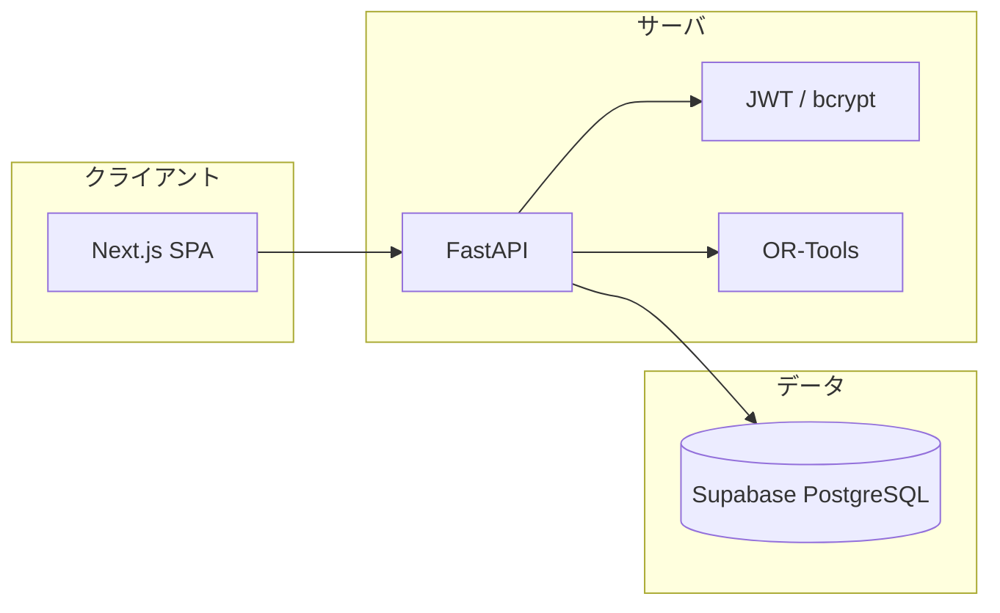
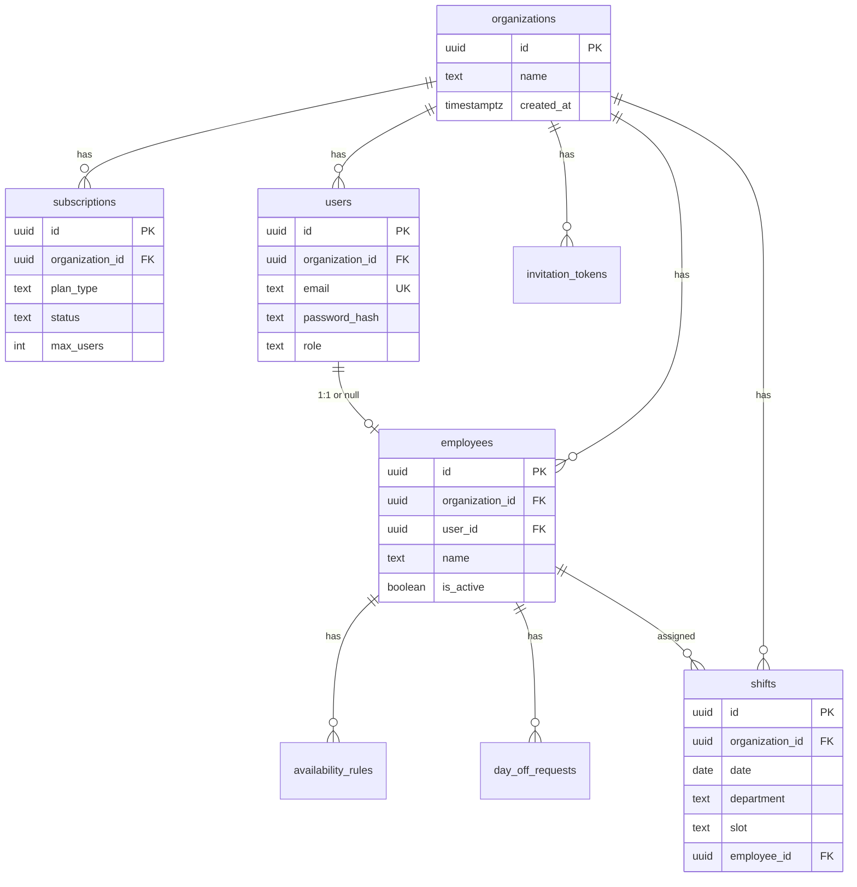

# Shiftora（公平なシフト管理を実現する業務最適化アプリ）

**Shiftora** は、介護事業所向けの**シフト管理・最適化アプリ**です。手作業や表計算に頼らないシフト作成と、組織単位のユーザー管理・招待機能により、管理業務の効率化と公平なシフト運用を実現します。

---

### 主要画面

- **職員管理（org_admin）**
- **シフト生成（org_admin）**
- **シフトカレンダー（org_admin）**
- **自分のシフト（staff）**
- **希望休（staff）**

---

### プロジェクト工程

- **開発開始日**: 2026/3/6
- **開発終了日**: 2026/3月中

---

## 目的 & 開発背景

多くの現場では、シフト作成や勤務調整がいまだに手作業や表計算ソフトに依存しており、担当者の経験や勘に頼る部分が大きくなっています。その結果、勤務日数の偏りや調整ミス、作業時間の増加といった問題が発生しやすく、管理者の負担が大きくなる傾向があります。

Shiftora は、こうしたシフト管理の課題を解決することを目的として開発されたアプリケーションです。シフト作成やメンバー管理をシステム化することで、管理業務の効率化と公平性の高いシフト運用を実現することを目指しています。また、複数のメンバーが関わるチーム運用を前提とし、組織単位でのユーザー管理や招待機能など、実際の業務で使いやすいシフト管理環境の構築を目標としています。

**本プロジェクトで実現すること**

- 手作業シフト作成の負荷を減らす
- 最低配置条件（デイ 4 人以上・訪問 AM/PM 各 1 人・半日兼務 2 人）の未達を防ぐ
- 半日兼務をアルゴリズムで自動反映する
- マルチテナント SaaS として設計・実装する

---

## ターゲット

- **介護事業所**（単一事業所、MVP では複数拠点は未対応）
- **部署:** デイサービス / 訪問介護の 2 種類
- 管理者（org_admin）と職員（staff）の 2 ロールを想定

---

## 機能（MVP）

- org_admin が職員を登録できる
- staff が希望休を登録できる
- org_admin が 1 ヶ月分のシフトを生成できる
- 生成したシフトを保存できる
- staff が自分のシフトを閲覧できる

---

## 技術スタック



- **Backend:** FastAPI、JWT（自前実装）、bcrypt、OR-Tools（シフト最適化）
- **Frontend:** Next.js（SPA）
- **Database:** Supabase（PostgreSQL）
- **Deployment:** Docker（ローカル）、Railway（本番）

---

## テーブル構造（Supabase）



---

## プロジェクト構成

```
Shiftora/
├── README.md
├── LICENSE
├── docker-compose.yml   # API コンテナ（ローカル）
├── .env.example
├── backend/
│   ├── Dockerfile
│   ├── requirements.txt
│   └── app/
│       ├── main.py      # FastAPI エントリ
│       └── auth/        # 認証・RBAC・register-org
└── docs/
    ├── 00-index.md
    ├── 01-overview.md
    ├── 02-architecture.md
    ├── 03-roles-and-usecases.md
    ├── 04-database.md
    ├── 05-auth-and-invitation.md
    ├── 06-subscription.md
    ├── 07-shift-logic.md
    ├── 08-api.md
    ├── 09-non-functional.md
    ├── 10-frontend.md
    ├── 11-development-order.md
    ├── 12-open-items.md
    └── 13-issues-and-branches.md
```

- **ルート:** 設定・Docker・ドキュメント。`.env` は git に含めない。
- **backend/app:** FastAPI アプリ。`auth` に認証・RBAC・register-org を集約。

---

## commitメッセージ

- feat：新機能追加
- fix：バグ修正
- hotfix：クリティカルなバグ修正
- add：新規（ファイル）機能追加
- update：機能修正（バグではない）
- change：仕様変更
- clean：整理（リファクタリング等）
- disable：無効化（コメントアウト等）
- remove：削除（ファイル）
- upgrade：バージョンアップ
- revert：変更取り消し
- docs：ドキュメント修正（README、コメント等）
- style：コードフォーマット修正（インデント、スペース等）
- perf：パフォーマンス改善
- test：テストコード追加・修正
- ci：CI/CD 設定変更（GitHub Actions 等）
- build：ビルド関連変更（依存関係、ビルドツール設定等）
- chore：雑務的変更（ユーザーに直接影響なし）

---

## 関連ドキュメント

| ファイル | 内容 |
|----------|------|
| [docs/00-index.md](docs/00-index.md) | 設計ドキュメント索引 |
| [docs/01-overview.md](docs/01-overview.md) | 用語定義・MVP 出荷条件・対象スコープ |
| [docs/02-architecture.md](docs/02-architecture.md) | 技術スタック・システムアーキテクチャ |
| [docs/03-roles-and-usecases.md](docs/03-roles-and-usecases.md) | ロール・権限・ユースケース |
| [docs/04-database.md](docs/04-database.md) | データベーススキーマ |
| [docs/05-auth-and-invitation.md](docs/05-auth-and-invitation.md) | 認証・招待フロー・register-org |
| [docs/06-subscription.md](docs/06-subscription.md) | サブスクリプション制御 |
| [docs/07-shift-logic.md](docs/07-shift-logic.md) | シフト生成ロジック・OR-Tools |
| [docs/08-api.md](docs/08-api.md) | API 設計・エンドポイント一覧 |
| [docs/09-non-functional.md](docs/09-non-functional.md) | 非機能要件・タイムゾーン・監査 |
| [docs/10-frontend.md](docs/10-frontend.md) | フロントエンド・画面一覧 |
| [docs/11-development-order.md](docs/11-development-order.md) | 開発順序 |
| [docs/12-open-items.md](docs/12-open-items.md) | 詰める候補 |
| [docs/13-issues-and-branches.md](docs/13-issues-and-branches.md) | Issue 一覧・ブランチ名 |
